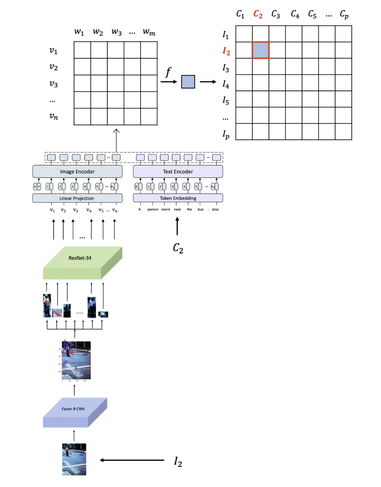

## Description

In this project, we want to develop a model with which you can find the specific photo given a short description. We firstly use a pretrained Faster R-CNN object detection model to find out objects in each image. Then we use a pretrained ResNet-34 model to generate object embedding for each detected object. Next, for each image, we pass object embeddings to an image encoder and pass each word in a text encoder. After that, we calculate the similarity score for each image-caption pair. Our entire model architecture is shown in below.

## Dataset

In this project, we used **Flickr30k Dataset**, which is a large corpus of 30K images and 150K descriptive captions. We split the whole dataset into a train set, a validation set and a test set. There are 1,000 images in both validation set and test set and 29,783 images in the train set. You can download the dataset and find the preprocess file at [here](https://github.com/BryanPlummer/flickr30k_entities).

## Object Dector

You can find a pretrained **Faster R-CNN object detection model** at [here](https://github.com/shilrley6/Faster-R-CNN-with-model-pretrained-on-Visual-Genome).

## Writeup

You can find our writeup at [here](https://docs.google.com/document/d/1cVsk5P0fYlyQjy05dqlTOunm5MycKCBoMQqiX8fE7tA/edit?usp=sharing).

## Presentation

You can find our project presentation at [here](https://devpost.com/software/find-a-photo-in-the-album).
